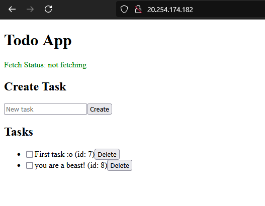
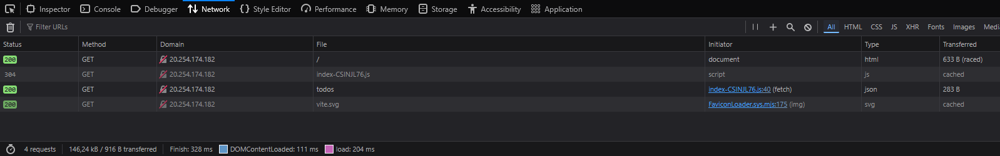

# C# Cloud Azure Day 3 - TerraForm

## My work

The files were stored using the following structure:

```
todo-app/
├── backend # Dotnet files
└── frontend # React files
    └── assets
```

I used NGINX to serve both the API and front end on the same port, but on different paths. [NGINX config file](./site.conf)



